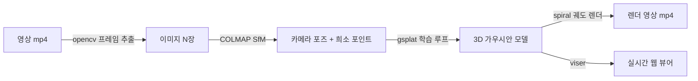

# 3DGS 학습 루프 정리 (gsplat `simple_trainer.py default`)

> 작성일: 2026-07-27 · 기준: gsplat 1.5.3 (로컬 소스 빌드, sm_120) · 검증 실행: `scene1` (95장, 7000스텝)

## 0. 전체 파이프라인 개요

```
영상 1개 (mp4)
   │  ① extract_frames.py (opencv, fps/max_frames)
   ▼
프레임 이미지 (data/processed/<name>/images/)
   │  ② run_colmap.sh (SfM)
   ▼
카메라 포즈 + 희소 포인트클라우드 (sparse/0)
   │  ③ simple_trainer.py default  ← ★ 이 문서의 주제
   ▼
가우시안 모델 (.pt / .ply) + 평가 지표
   │  ④ spiral 궤도 렌더 (학습 종료 시 자동)
   ▼
궤도 렌더 영상 (outputs/<name>/videos/traj_*.mp4)
```



---

## 1. 초기화 — SfM 포인트 → 가우시안

COLMAP `sparse/0`의 희소 포인트 하나가 가우시안 하나가 된다 (`create_splats_with_optimizers`).

| 파라미터 | 초기값 | 비고 |
|---|---|---|
| `means` (위치) | SfM 포인트 좌표 | |
| `scales` (크기) | `log(KNN 평균거리 × init_scale)` | 이웃 3점 평균 거리, `init_scale=1.0` |
| `quats` (회전) | 랜덤 쿼터니언 | |
| `opacities` (불투명도) | `logit(0.1)` | `init_opa=0.1` |
| `sh0` / `shN` (색) | 포인트 RGB → SH 0차 / 0 | SH 최대 3차 (`sh_degree=3`) |

scene1 기준: 초기 37,104개 → 학습 후 861,775개 (densification으로 약 23배 증가).

---

## 2. 학습 루프 — 스텝당 흐름

매 스텝(기본 `batch_size=1`) 반복:

```
┌─────────────────────────────────────────────────────────┐
│ 1) 학습 이미지 1장 + 카메라 포즈 샘플링                     │
│ 2) rasterization() — 가우시안을 해당 뷰로 미분가능 렌더     │
│ 3) 손실 계산:                                             │
│       loss = 0.8 × L1  +  0.2 × (1 − SSIM)               │
│       (ssim_lambda=0.2, 정규화항 opacity/scale_reg=0)      │
│ 4) backward — 모든 가우시안 파라미터에 gradient            │
│ 5) optimizer.step() — 파라미터별 Adam                     │
│ 6) DefaultStrategy — densification/pruning (아래 §3)      │
│ 7) 스케줄 갱신 — SH 차수, learning rate                    │
└─────────────────────────────────────────────────────────┘
```

### Learning rate (파라미터별 Adam)

| 파라미터 | LR | 스케줄 |
|---|---|---|
| `means` | 1.6e-4 × scene_scale | ExponentialLR, max_steps 동안 1/100로 감쇠 |
| `scales` | 5e-3 | 고정 |
| `opacities` | 5e-2 | 고정 |
| `quats` | 1e-3 | 고정 |
| `sh0` | 2.5e-3 | 고정 |
| `shN` | 1.25e-4 (2.5e-3/20) | 고정 |

### SH(구면조화) 차수 스케줄

`sh_degree_interval=1000`: 0차로 시작해 1000스텝마다 +1, 3000스텝 이후 3차(풀 컬러 표현) 사용.

---

## 3. Densification — DefaultStrategy (원조 3DGS 방식)

`refine_start_iter=500` ~ `refine_stop_iter=15000` 구간에서 `refine_every=100`스텝마다:

| 동작 | 조건 | 효과 |
|---|---|---|
| **Duplicate** (복제) | 화면공간 gradient > `2e-4` 이고 크기가 작음 (`grow_scale3d=0.01`) | 디테일 부족한 곳에 가우시안 추가 |
| **Split** (분할) | 화면공간 gradient > `2e-4` 이고 크기가 큼 | 큰 가우시안을 작은 2개로 쪼갬 |
| **Prune** (제거) | opacity < `prune_opa=0.005` | 기여 없는 가우시안 삭제 |
| **Opacity reset** | `reset_every=3000`스텝마다 전체 opacity를 낮게 리셋 | 과적합·유령 가우시안 정리 |

> 7000스텝 학습은 densification 구간(≤15000) 안에서 끝나므로 마지막까지 개수가 늘어난다.
> 30000스텝 학습이면 15000 이후는 위치/색 미세조정만 진행.

---

## 4. 평가 · 저장 · 렌더링

`eval_steps = save_steps = ply_steps = [7000, 30000]` (기본값):

- **평가**: 검증 뷰(8장당 1장)에 대해 PSNR / SSIM / LPIPS → `stats/val_step*.json`
- **체크포인트**: `ckpts/ckpt_<step>_rank0.pt`
- **PLY 내보내기** (`--save-ply`): `ply/point_cloud_<step>.ply`
- **궤도 렌더** (`--render-traj-path spiral`): 학습 카메라 궤적을 감싸는 나선 경로 120프레임 → `videos/traj_<step>.mp4`
- 텐서보드 로그: `tb/` (`venv/bin/tensorboard --logdir outputs/<name>/tb`)

---

## 5. 검증 실행 결과 (scene1, 2026-07-27)

| 항목 | 값 |
|---|---|
| 입력 | `20260727_094002.mp4` (60fps, 약 31초, 2160×3840 세로) |
| 프레임 | 95장 (3fps 샘플링, max 100) |
| COLMAP | **95/95장 등록**, 37,104 포인트, 재투영오차 1.008px |
| 학습 | 7000스텝, **10분 12초** (RTX 5080, 4K 원본 해상도) |
| 최종 가우시안 | 861,775개 |
| PSNR / SSIM / LPIPS | **24.06 / 0.920 / 0.178** |
| 산출물 | `outputs/scene1/` — ply 194MB, traj 영상 6.8MB |

---

## 6. 실행 명령어 레퍼런스

### 6-0. 최초 환경 구축 (1회, 2026-07-27 완료된 상태)

```bash
cd ~/ssafy/3d-gaussian-splatting/GS

# 스크립트가 참조하는 v3 경로를 실제 venv로 연결
ln -sfn venv v3

# 의존성 설치 — requirements.txt의 torch==2.9.1 핀은 제외하고 설치할 것!
# (현재 venv의 torch 2.11.0+cu128 을 덮어쓰면 안 됨)
uv pip install --python venv/bin/python torchvision==0.26.0 \
  --index-url https://download.pytorch.org/whl/cu128
uv pip install --python venv/bin/python \
  pycolmap viser \
  "git+https://github.com/nerfstudio-project/nerfview@4538024fe0d15fd1a0e4d760f3695fc44ca72787" \
  "imageio[ffmpeg]" scipy scikit-learn tqdm "torchmetrics==1.8.2" \
  opencv-python-headless "tyro>=0.8.8,!=1.0.9,!=1.0.10" piexif \
  tensorboard tensorly pyyaml matplotlib splines

# gsplat 로컬 소스 빌드 (RTX 5080 sm_120 타깃 — 약 60~70분 소요)
cd gsplat
TORCH_CUDA_ARCH_LIST=12.0 MAX_JOBS=16 uv pip install \
  --python ../venv/bin/python -e . --no-build-isolation

# 설치 검증
cd /tmp && ~/ssafy/3d-gaussian-splatting/GS/venv/bin/python \
  -c "import gsplat, cv2, pycolmap, viser; print('OK', gsplat.__version__)"
```

### 6-1. 원커맨드 E2E (프레임 추출 → COLMAP → 학습 → 렌더)

```bash
cd ~/ssafy/3d-gaussian-splatting/GS
bash scripts/run_e2e.sh data/videos/<영상>.mp4 <scene이름> [fps=3] [max_frames=250] [iters=30000]

# 예: 오늘 스모크 테스트와 동일한 설정
bash scripts/run_e2e.sh data/videos/20260727_094002.mp4 scene1 3 100 7000
```

### 6-2. 단계별 수동 실행

```bash
cd ~/ssafy/3d-gaussian-splatting/GS

# (1) 영상 → 프레임 (opencv)
venv/bin/python scripts/extract_frames.py \
  data/videos/<영상>.mp4 data/processed/<scene>/images --fps 3 --max 100

# (2) COLMAP SfM (GPU SIFT). 결과: data/processed/<scene>/sparse/0
bash scripts/run_colmap.sh data/processed/<scene>
# 등록 결과 확인
colmap model_analyzer --path data/processed/<scene>/sparse/0 2>&1 | grep -iE 'Registered|points'

# (3) gsplat 학습 (+ 종료 시 spiral 궤도 렌더 자동)
cd gsplat/examples
TORCH_CUDA_ARCH_LIST=12.0 ../../venv/bin/python simple_trainer.py default \
  --data-dir ../../data/processed/<scene> --data-factor 1 \
  --result-dir ../../outputs/<scene> \
  --max-steps 7000 --render-traj-path spiral --disable-viewer --save-ply
```

### 6-3. 학습만 다시 (COLMAP 결과 재사용)

프레임 수를 안 바꿨다면 (1)(2)는 생략 가능 — 예: scene1을 30000스텝으로 재학습:

```bash
cd ~/ssafy/3d-gaussian-splatting/GS/gsplat/examples
TORCH_CUDA_ARCH_LIST=12.0 ../../venv/bin/python simple_trainer.py default \
  --data-dir ../../data/processed/scene1 --data-factor 1 \
  --result-dir ../../outputs/scene1_full \
  --max-steps 30000 --render-traj-path spiral --disable-viewer --save-ply
```

### 6-4. 렌더만 다시 (학습 없이, 기존 체크포인트 사용)

```bash
cd ~/ssafy/3d-gaussian-splatting/GS/gsplat/examples
TORCH_CUDA_ARCH_LIST=12.0 ../../venv/bin/python simple_trainer.py default \
  --data-dir ../../data/processed/scene1 --data-factor 1 \
  --result-dir ../../outputs/scene1 \
  --render-traj-path spiral --disable-viewer \
  --ckpt ../../outputs/scene1/ckpts/ckpt_6999_rank0.pt
```

### 6-5. 결과 확인

```bash
cd ~/ssafy/3d-gaussian-splatting/GS

# 실시간 뷰어 (viser) — http://localhost:8080
bash scripts/view.sh scene1
# WSL에서 localhost 접속 안 되면: http://<WSL IP>:8080  (hostname -I 로 확인)
# localhost 포워딩 복구: PowerShell에서 wsl --shutdown 후 WSL 재시작

# 평가 지표 / 텐서보드
cat outputs/scene1/stats/val_step6999.json
venv/bin/tensorboard --logdir outputs/scene1/tb   # http://localhost:6006

# 산출물 위치
ls outputs/scene1/videos/   # traj_*.mp4 궤도 렌더 영상
ls outputs/scene1/ply/      # point_cloud_*.ply 3D 모델
```

---

## 7. 튜닝 가이드

| 목적 | 조정 |
|---|---|
| 품질 ↑ | `iters` 30000, 프레임 200~250장 (COLMAP 재실행 필요) |
| VRAM 부족 / 속도 ↑ | `--data-factor 2` (이미지 1/2 다운스케일) 또는 `max_frames` 축소 |
| 흐릿한 디테일 | `grow_grad2d` 낮춤 (예: 1e-4) → 가우시안 더 공격적으로 증식 |
| 노이즈/유령 가우시안 | `prune_opa` 높임 (예: 0.01), `opacity_reg` > 0 |
| 카메라 흔들림 심한 영상 | `--pose-opt` (카메라 포즈 동시 최적화) |
| SSIM 손실 가속 | `fused-ssim` 설치 (현재 미설치 — 순수 torch 폴백으로 동작 중) |

### 이 환경의 주의점 (RTX 5080 / WSL2)

- gsplat CUDA 커널은 `TORCH_CUDA_ARCH_LIST=12.0`으로 빌드됨 — 재빌드 시 동일 환경변수 필요
- venv 경로: 스크립트는 `v3/`를 참조하며, `v3 → venv` 심볼릭 링크로 연결되어 있음
- `gsplat/examples/requirements.txt`의 `torch==2.9.1` 핀을 그대로 설치하면 안 됨 (현재 torch 2.11.0+cu128 사용 중)
